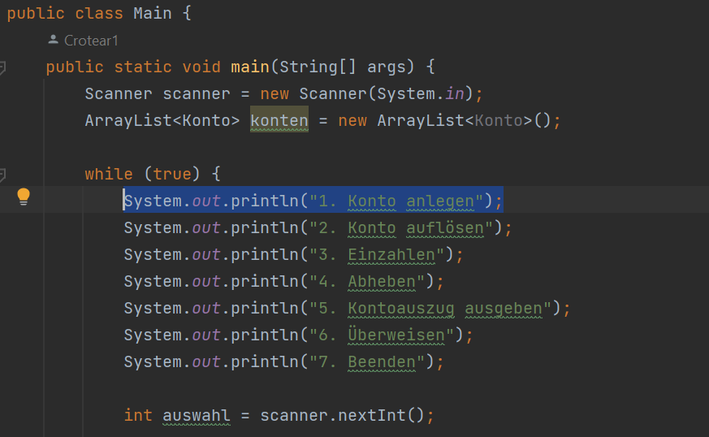

# ITL12

Mehrere Branches besitzen verschiedene Übungsbeispiele.

## Table of Contents

- [ITL12](#itl12)
  - [Features](#introduction)
  - [Programmiersprache](#introduction)
  - [Installation](#introduction)


## Features

Liste von den features

- Vererbung
- Konto

## Programmiersprache
``` java

public class Main {
    public static void main(String[] args) {
      System.out.println("Hello World!");
}

```


### Installation
- Klonen Sie das Repository und wechseln Sie zwischen Zweigen

- Starten Sie die main Methode in der IDE
```
git clone https://github.com/Crotear1/ITL12.git
```

